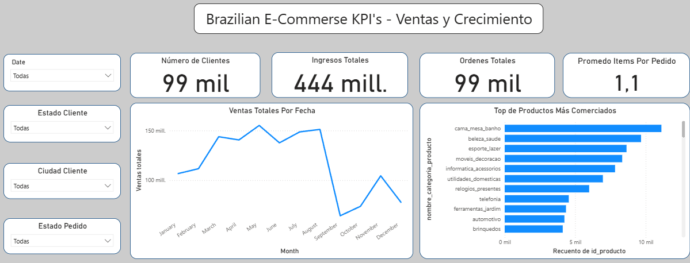
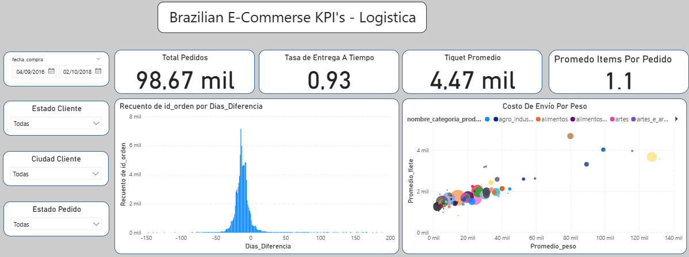
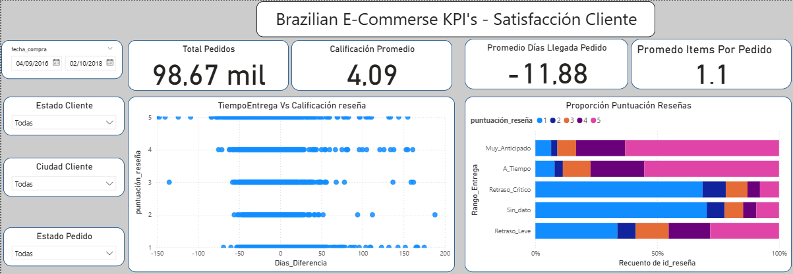

# 🛒 Análisis Comercio Electrónico Brasil — Olist

## 📌 Contexto

Análisis end-to-end del dataset público de Olist, marketplace brasileño  con ~100,000 pedidos entre 2016 y 2018. El objetivo es identificar 
oportunidades de mejora en logística, satisfacción del cliente y segmentación de clientes.

---

## 🎯 Preguntas de Negocio

- ¿Qué factores impactan la satisfacción del cliente?
- ¿Cómo es el desempeño logístico por región?
- ¿Cuáles son las categorías y períodos más rentables?

---

## 📊 Dashboard Power BI

### Ventas y Crecimiento

### Logística

### Satisfacción del Cliente

---

## 🛠️ Herramientas Utilizadas

| Herramienta | Uso |
|---|---|
| Python + Pandas | Limpieza y transformación de datos |
| SQL (SQLite) | Análisis y consultas |
| Matplotlib / Seaborn | Visualizaciones exploratorias |
| Power BI | Dashboard interactivo |
| GitHub | Control de versiones |

---

## 🔍 Principales Hallazgos

- Los pedidos con **Retraso Crítico** concentran la mayoría de calificaciones 1 y 2, mientras que las entregas **A Tiempo** tienen más del 60% de calificaciones en 5 estrellas.
- En promedio, los pedidos llegan **casi 12 días antes** de la fecha estimada, lo que sugiere que las promesas de entrega son conservadoras.
- La categoría **cama, mesa y baño** es la más comercializada, seguida por belleza & salud y deportes & ocio.
- Existe una correlación positiva clara entre **peso del producto y costo de envío**, con algunas categorías como electrodomésticos presentando flete desproporcionadamente alto.
- El GMV muestra **estacionalidad marcada**, con picos en los meses de mitad de año y caída en el último trimestre del período analizado.

---

## 👤 Autor

**[Tu Nombre]**  
Analista de Datos Jr.
